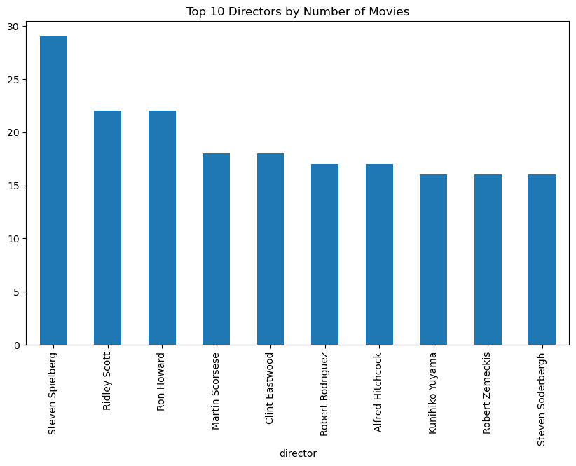
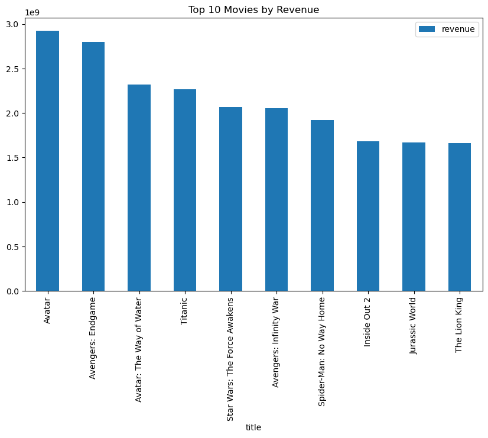
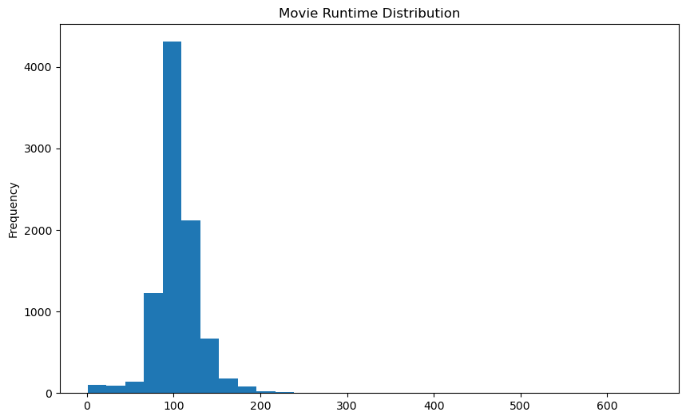
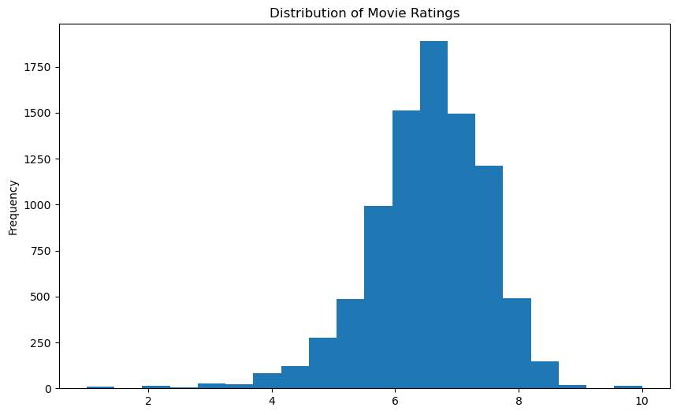

# Exploratory Data Analysis (EDA) - Movie Dataset

## Overview

This document outlines the exploratory data analysis (EDA) performed on the movie dataset. The goal of EDA is to understand the dataset's structure, identify key trends, and derive insights that can be useful for building a movie recommendation system.

## Dataset Information

The dataset consists of 9,130 movies with various attributes such as title, genres, cast, crew, revenue, and more.

Missing values were handled appropriately by filling them with empty strings where necessary.

Redundant columns, such as homepage, were dropped due to excessive missing values.

## Steps Performed

### **1. Data Exploration**

Displayed dataset structure using `df.info()` and `df.describe()`.

Checked for missing values and decided on handling strategies.

Identified key numerical statistics such as mean, max, and min values.

## Insights

**1. Top 10 Most Popular Actors**

- The graph tells us that Nicolas Cage and Jackie Chan have the highest popularity scores. Other actors like Tom Hanks, Bruce Willis, and Robert De Niro follow closely behind, all with similar scores. The chart offers a comparative view of their fame based on these scores.
- The most popular actors in the dataset have appeared in multiple high-grossing movies.
- Actor popularity is based on the number of appearances in movies.

**2. Top 10 Most Popular Directors**

- Steven Spielberg stands out as the most prolific director on this list, with nearly 30 movies. It reflects his long-standing and active career in Hollywood.
- Ridley Scott and Ron Howard follow, each having directed just over 20 movies.
- Martin Scorsese, Clint Eastwood, and Robert Rodriguez are in the mid-range, with 15–20 movies.

**3. Top 10 Movies by Revenue**

- In this analysis, we identified the top 10 movies based on their total revenue.
- The dataset includes revenue data, and we sort the movies by their revenue in descending order to highlight the highest-grossing films.
- "Avatar" is the highest-grossing movie, generating close to $3 billion in revenue.
- "Avengers: Endgame" follows closely behind, with revenue slightly under $3 billion.
- The movies in the lower range still achieved impressive box office revenues, around $1.5–2 billion.

**4. Average Runtime**

- The mean runtime is useful for understanding the typical length of movies in the dataset and can highlight any trends, such as whether shorter or longer movies are more common in certain genres or periods.
- The average run time of a movie is 100 minutes

**5. Average Voting Score Distribution**

- Most movies are rated around 6, which is the most common score in the data.
- Very few movies have extremely low (below 4) or extremely high (above 8) ratings.
- The ratings form a bell-shaped pattern, with the majority of scores clustering in the middle.
- The overall distribution is fairly balanced, but there are slightly more higher ratings (above 5) than lower ones.

**6. Top Production Companies**

