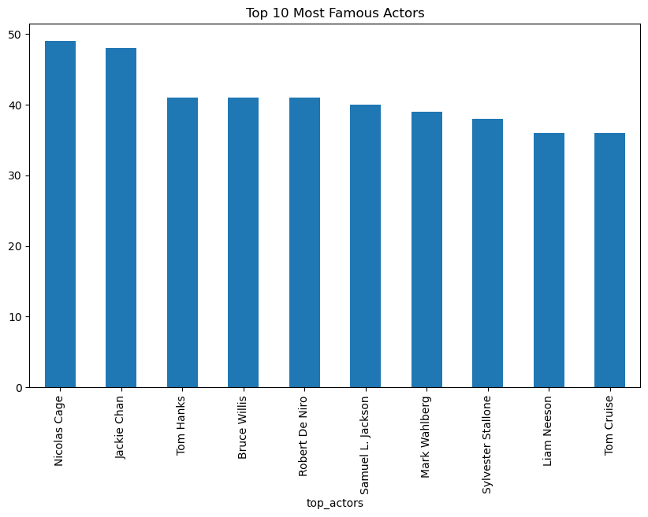

# Exploratory Data Analysis (EDA) - Movie Dataset

## Overview

This document outlines the exploratory data analysis (EDA) performed on the movie dataset. The goal of EDA is to understand the dataset's structure, identify key trends, and derive insights that can be useful for building a movie recommendation system.

## Dataset Information

The dataset consists of 9,130 movies with various attributes such as title, genres, cast, crew, revenue, and more.

Missing values were handled appropriately by filling them with empty strings where necessary.

Redundant columns, such as homepage, were dropped due to excessive missing values.

## Steps Performed

### **1. Data Exploration**

Displayed dataset structure using `df.info()` and `df.describe()`.

Checked for missing values and decided on handling strategies.

Identified key numerical statistics such as mean, max, and min values.

## Insights

**1. Top 10 Most Popular Actors**

