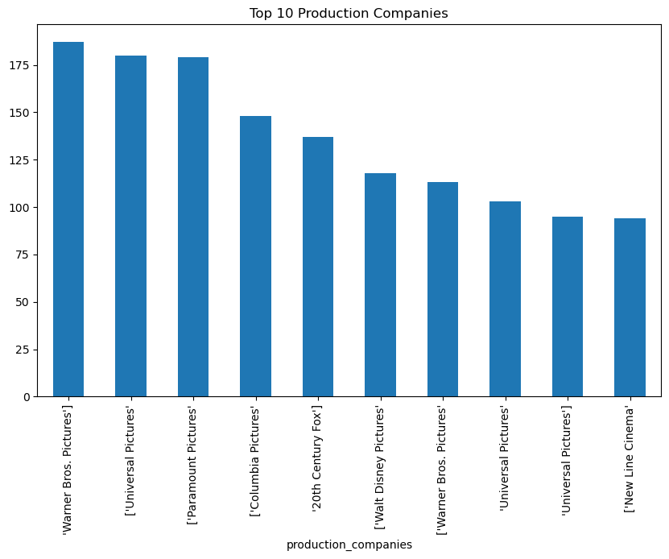
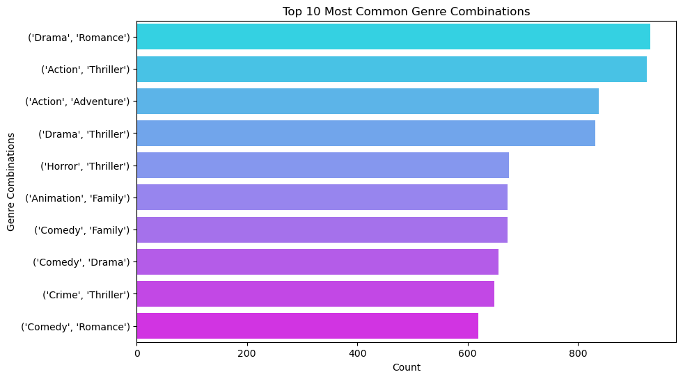

# Exploratory Data Analysis (EDA) - Movie Dataset

## Overview

This document outlines the exploratory data analysis (EDA) performed on the movie dataset. The goal of EDA is to understand the dataset's structure, identify key trends, and derive insights that can be useful for building a movie recommendation system.

## Dataset Information

The dataset consists of 9,130 movies with various attributes such as title, genres, cast, crew, revenue, and more.

Missing values were handled appropriately by filling them with empty strings where necessary.

Redundant columns, such as homepage, were dropped due to excessive missing values.

## Steps Performed

### **1. Data Exploration**

Displayed dataset structure using `df.info()` and `df.describe()`.

Checked for missing values and decided on handling strategies.

Identified key numerical statistics such as mean, max, and min values.

## Insights

#### **1. Top 10 Most Popular Genres**

- Drama is the most popular genre, known for its emotional storytelling and relatable characters that appeal to a wide audience.
- Comedy comes second, providing light-hearted, humorous content that is universally enjoyed and often used to escape daily stresses.
- Action ranks third, captivating viewers with intense, fast-paced sequences and adrenaline-pumping experiences.
- These genres are popular because they offer a range of emotions and experiences—whether it's emotional depth, laughter, or excitement—ensuring broad appeal across diverse audiences.

#### **2. Top 10 Most Popular Actors**

- The graph tells us that Nicolas Cage and Jackie Chan have the highest popularity scores. Other actors like Tom Hanks, Bruce Willis, and Robert De Niro follow closely behind, all with similar scores. The chart offers a comparative view of their fame based on these scores.
- The most popular actors in the dataset have appeared in multiple high-grossing movies.
- Actor popularity is based on the number of appearances in movies.

#### **3. Top 10 Most Popular Directors**

- Steven Spielberg stands out as the most prolific director on this list, with nearly 30 movies. It reflects his long-standing and active career in Hollywood.
- Ridley Scott and Ron Howard follow, each having directed just over 20 movies.
- Martin Scorsese, Clint Eastwood, and Robert Rodriguez are in the mid-range, with 15–20 movies.

#### **4. Top 10 Movies by Revenue**

- In this analysis, we identified the top 10 movies based on their total revenue.
- The dataset includes revenue data, and we sort the movies by their revenue in descending order to highlight the highest-grossing films.
- "Avatar" is the highest-grossing movie, generating close to $3 billion in revenue.
- "Avengers: Endgame" follows closely behind, with revenue slightly under $3 billion.
- The movies in the lower range still achieved impressive box office revenues, around $1.5–2 billion.

#### **5. Average Runtime**

- The mean runtime is useful for understanding the typical length of movies in the dataset and can highlight any trends, such as whether shorter or longer movies are more common in certain genres or periods.
- The average run time of a movie is 100 minutes

#### **6. Average Voting Score Distribution**

- Most movies are rated around 6, which is the most common score in the data.
- Very few movies have extremely low (below 4) or extremely high (above 8) ratings.
- The ratings form a bell-shaped pattern, with the majority of scores clustering in the middle.
- The overall distribution is fairly balanced, but there are slightly more higher ratings (above 5) than lower ones.

#### **7. Top Production Companies**

- "Warner Bros. Pictures," "Universal Pictures," and "Paramount Pictures" are the top three companies, each contributing approximately 175-180 movies.
- Other major contributors include "Columbia Pictures," "20th Century Fox," and "Walt Disney Pictures," with movie counts ranging between 125 and 150.
- The chart demonstrates that these companies are key players in the movie industry, with a relatively small difference in movie production among the top contributors.

#### **8. Language Distribution**

- The chart shows the distribution of movies by language, with each bar representing a specific language and its corresponding number of movies produced.
- The most common language is English, dominating the chart with the highest number of movies.
- Other languages such as Japanese, Spanish and French have moderate representation
- Languages with fewer movies may still represent niche or regional industries, showcasing the diversity of content across cultures.

#### **9. Release Year Distribution**

- The first significant surge in movie production occurred in the 1950s, marking a period of rapid growth in the film industry.
- The dataset shows that the highest number of movies were produced around 2021 or 2022, indicating a peak in film production during these years.
- A noticeable decline in movie production was observed in 2020, likely due to the impact of the COVID-19 pandemic, which led to disruptions in filming schedules, theater closures, and delays in movie releases.

#### **10. Genre vs Revenue**

- Adventure is the highest-grossing genre, with the largest average revenue, due to its broad appeal across demographics and blockbuster franchises like Pirates of the Caribbean and Indiana Jones.
- Science Fiction follows closely, driven by global franchises like Star Wars and Marvel's Avengers, which offer futuristic themes and cutting-edge visual effects.
- Family films rank third in average revenue, appealing to all age groups and benefiting from the success of major franchises like Disney and Pixar.
- These genres dominate because they feature high production values, wide audience appeal, and established franchises with loyal fan bases.

#### **11. Voting vs Revenue**

- By analyzing this relationship, we can determine whether higher-rated movies tend to generate more revenue.
- High ratings might contribute to higher revenue, but they are not the only factor. Marketing, genre, star power, and franchise recognition could also play major roles.
- Most movies earn moderate revenue regardless of vote average, but exceptional movies (both in quality and marketing) can achieve massive financial success.

#### **12. Genre Combinations**

- Drama and Romance is the most common genre combination, offering emotional and character-driven stories that resonate with a broad audience.
- Action and Thriller ranks second, combining intense action with suspense, attracting viewers who enjoy high-stakes excitement.
- Action and Adventure follows closely, delivering thrilling action sequences paired with adventurous storylines that captivate fans of escapism.
- These combinations dominate because they appeal to a wide range of audiences, blending emotional depth, excitement, and suspense in ways that cater to diverse tastes.

#### **13. Correlation Heatmap**

- The graph shows the correlation between different aspect of the film
- Revenue and Vote Count (0.75) show a strong positive correlation, indicating that films with more votes tend to have higher revenue, suggesting greater audience engagement and interest.
- Budget and Revenue (0.73) also have a strong positive correlation, meaning that higher budgets are generally associated with higher revenue, typical of large-scale blockbusters.
- Runtime and Vote Count (0.60) show a moderate positive correlation, implying that longer films may receive more votes, likely due to their perceived higher production value or deeper narratives.
- Vote Average and Revenue (0.16) shows a weak positive correlation, indicating that the average vote or rating has a relatively small impact on a film’s revenue compared to other factors like budget or vote count.

